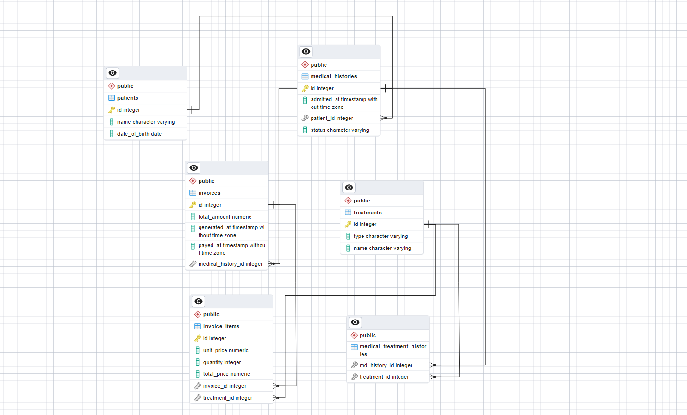

# postgres-setup

<!-- TABLE OF CONTENTS -->

# 📗 Table of Contents

- [📖 About the Project](#about-project)
  - [🎦 Video Description](#video)
  - [🛠 Built With](#built-with)
    - [Tech Stack](#tech-stack)
    - [Key Features](#key-features)
  - [🚀 Live Demo](#live-demo)
- [💻 Getting Started](#getting-started)
  - [Setup](#setup)
  - [Prerequisites](#prerequisites)
  - [Install](#install)
  - [Usage](#usage)
  - [Run tests](#run-tests)
  - [Deployment](#triangular_flag_on_post-deployment)
- [👥 Authors](#authors)
- [🔭 Future Features](#future-features)
- [🤝 Contributing](#contributing)
- [⭐️ Show your support](#support)
- [🙏 Acknowledgements](#acknowledgements)
- [📝 License](#license)

  

# 📖 Vet Clinic DataBase 

In this Repo I use PostgreSQL to create a relational database for a vet clinic.

## 🛠 Built With 

- PostgreSQL

### Tech Stack 

  
Client

  <ul>
  </ul>

  
Server

  <ul>
  <li>PostgreSQL</li>
  </ul>

<!-- Features -->

## Key Features

- Create a table using `CREATE TABLE table_name()`
- Add entries using `INSERT INTO table_name VALUES()`
- Write queries to get information from the table

(<a href="#readme-top">back to top</a>)

<!-- GETTING STARTED -->

## 💻 Getting Started 

To get a local copy up and running, follow these steps.

### Setup

Clone this repository to your desired folder:

`cd [your-folder] git@github.com:yonas44/postgres-setup.git`

(<a href="#readme-top">back to top</a>)

<!-- AUTHORS -->

## 👥 Authors 

👤 **Author**

- GitHub: [@yonas44](https://github.com/yonas44)
- LinkedIn: [Yonas Tesfu](linkedin.com/in/yonas-tesfu)

(<a href="#readme-top">back to top</a>)

## 🔭 Future Features 

- [ ] Add new Database with complex table relationships.
- [ ] Query multiple databases.
- [ ] Join multiple tables to make complex queries.
- [ ] Backup database for security.

## Contributing

Contributions, issues, and feature requests are welcome!
Feel free to check the [issues page](https://github.com/yonas44/postgres-setup/issues).

## Show your support

Give a ⭐️ if you like this project!

## 📝 License

This project is [MIT](./MIT.md) licensed.

(<a href="#readme-top">back to top</a>)

